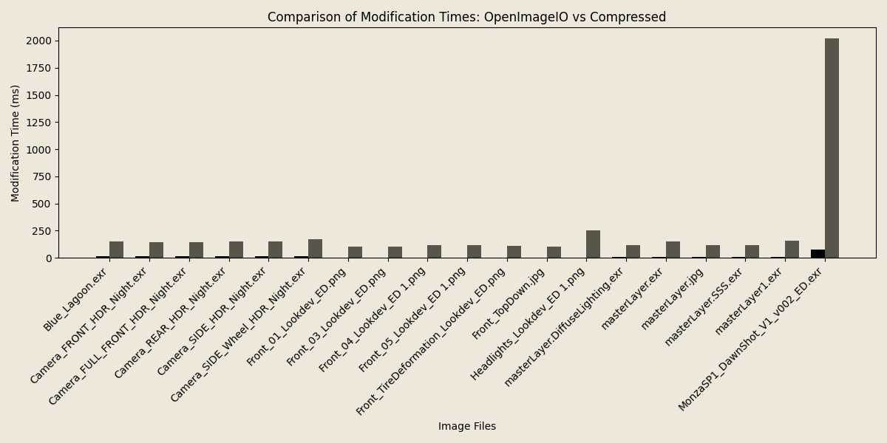
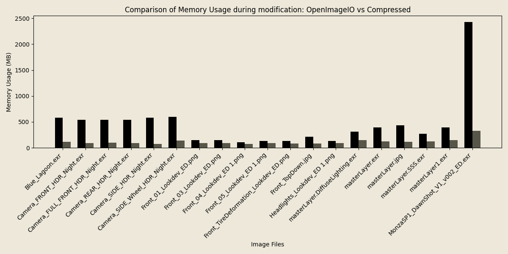

..
  Copyright Contributors to the compressed-image project.

.. _benchmarks:

As the ``compressed-image`` library is intended for high-performance computing, the performance and memory usage is one of
the foremost concerns.

Below you can find benchmarks generated using the ``benchmark/`` subfolder on the `github repository <https://github.com/EmilDohne/compressed-image/tree/master/benchmark>`_.

Some, but not all, of the images used for generating these graphs can be found on this `google drive <https://drive.google.com/drive/folders/1ONQgSFzp9fy4AZM2EbEufKj9BRK8Uo0s>`_.
To run the benchmarks yourself make sure to copy the images into the ``benchmark/`` folder after which the benchmarks will 
automatically instantiate.

Each of the benchmarks were repeated 5 times and verified on two different machines, for the benchmarks you can see below 
the following machine was used:

CPU: AMD Ryzen 9950x
RAM: 96GB DDR4 3200MHz
Drive: Samsung 980 1TB NVMe

In-memory compression
#######################

Below you can see some graphs comparing both the execution time and average memory usage comparing ``compressed-image``
and `OpenImageIO <https://github.com/AcademySoftwareFoundation/OpenImageIO>`_ during read of files. 

As can be seen, while speed is largely equal, if not slightly favoring the ``compressed-image`` library, the average memory
usage during the read is significantly lower. This allows much larger images to be pulled into memory at once at very
comparable performance.

.. figure:: images/bench/oiio_vs_compressed.png
	A graph showing the relationship of decoding speed using OpenImageIO vs compressed::image showing roughly
	equal performance

.. figure:: images/bench/oiio_vs_compressed_mem_usage.png
	A graph showing the relationship of memory usage during read using OpenImageIO vs compressed::image showing
	significantly lower usage with compressed::image

These memory savings can largely be attributed to the chunking of data, only ever loading a slice of an image into memory
while compressing the data as we go. This is also the primary reason why the read performance is comparable to that of 
``OpenImageIO``. **Compressing data on the fly is cheaper than having to allocate all of it.** In fact, the read() methods
of ``compressed-image`` use OIIO under the hood.

.. figure:: images/chunked_image.jpg
	:scale: 50 %
	:alt: An image showing the chunking process of an image.

	Illustration of how an image may be chunked in memory, being split into chunks of discrete scanlines.

Where's the catch?
*******************

This all sounds great! But where's the catch? 

While read (and in the future write) performance is largely similar as it is memory-bound rather than cpu-bound, modifying
the images later does invoke the cost of de- and re-compressing the data which you would not have to pay if you had the same
data in memory as an uncompressed buffer.

	A graph showing the relationship of modification speed using OpenImageIO vs compressed::image showing significantly
	slower speeds modifying with compressed::image

However, as before, the memory usage during these operations is still significantly reduced.

	A graph showing the relationship of memory usage during modification using OpenImageIO vs compressed::image showing
	significantly lower usage with compressed::image

What can we do?
*******************

There are some ways to mitigate these limitations in modification speed when using the ``compressed-image`` library.
Most prominently, the cpp ``compressed::image::read`` functions have overloads taking a function callback that can be 
used to perform operations on the image between the read and compression stage.

This is significantly more performant than first reading the image, and then modifying and should be the go to method
when you know ahead of time what operations you want to perform on an image/channels. An example of this would be
**color space conversions**.

For more information, please refer to: :ref:`compressed_image`.

.. note:: 

	These callbacks will also come to the python API as well as the write functions in future releases.

