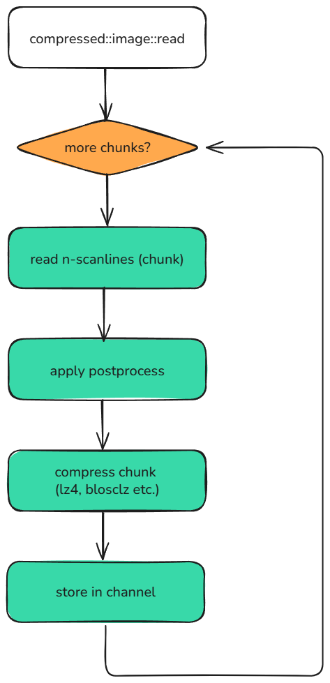

..
  Copyright Contributors to the compressed-image project.

.. _best_practices:

best practices
###############

This page will go over some of the best practices when using the ``compressed-image`` api both when writing your code
in c++ and python. The list is by no means exhaustive but should give some good ideas to base your design decisions
off of.

As always: ``don't assume-measure`` performance of your code! This guide is meant to give some guidelines but the performance
of your specific program should be tested

batch modifications where possible
***********************************

This practice applies to all code but it is even more pertinent when using the ``compressed-image`` api. Whenever possible
you should batch your modifications into one operation since de- and re-compressing the data has a non-zero cost which is
greater than if you would have the full image in memory. 

So if you find yourself modifying the same image/channel over and over it is probably best to batch all of these operations
into a single run.

use postprocesses on read (cpp)
********************************

When reading files from disk the cpp api provides the ``postprocess`` argument allowing you to modify data before it is 
compressed. This allows you to inject some processing that modifies the image which is much more efficient than
later decompressing the image.

The postprocess is best suited for generic processing such as:

- color space conversions
- stat accumulation
- denoising/filtering.
- other generic transforms

Because it operates on the data as it’s being read, this method avoids the cost of decompressing and recompressing later.

For an example on how to use it look at :ref:`postprocess`

prefer lazy channels
*********************

Both the python and cpp api have lazy-channel support via the ``image``/``channel`` ``zeros``, ``zeros_like``, ``full``
and ``full_like`` methods. These lazy channels are the best way of initializing an image if you intend to fill it in chunks
as they are extremely cheap to initialize both in terms of speed and in terms of memory usage.

Have a look at :ref:`lazy_channels` for more details on how to use them

