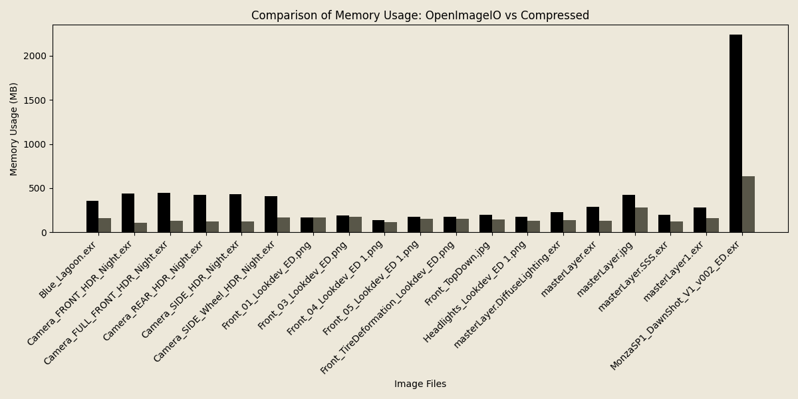

..
  Copyright Contributors to the compressed-image project.

compressed-image
########################################

.. raw:: html

	 

About
=========

``compressed-image`` is a library for reading, storing and modifying images and channels as compressed in-memory buffers
allowing for very memory-efficient representations of these. This library acts as a stop-gap between storing images purely
in-memory and reading them from disk on-demand. 

It trades a bit of performance for significantly lower memory usage. For more detailed
information please have a look at the benchmark section :ref:`benchmarks`

It is written entirely using C++20 while also providing pre-built python binaries that are pip-installable.

Features
=========

- Storing images as compressed buffers
- Reading files from disk with low memory usage
- Random access decompression without having to decompress the entire image
- Lazy image/channel representations with extremely low memory footprints
- Cross-platform support
- Interoperability with NumPy

When should you use this?
==========================

Performance
===========

The ``compressed-image`` library is aimed at high performance computing allowing you to store many images in-memory
simultaneously while not having to pay the associated memory cost. It performs equal or faster during image reads
with significantly lower memory usage

.. image:: images/bench/oiio_vs_compressed.png
	:alt: A graph showing the relationship of decoding speed using OpenImageIO vs compressed::image showing roughly
		  equal performance

		  significantly lower usage with compressed::image

Quickstart
==========

This is a simple example of getting you up and running with compressed-image, loading a file from disk and then interacting
with the channels

.. tab:: c++

    .. code-block:: cpp

		#include <compress/image.h>

		auto image = compressed::image<uint8_t>::read("/some/file/path");
		auto channel_r = image.channel("R"); // could also get it via image.channel(0)

		// Iterate over the chunks in the channel, this will decompress the chunk and recompress it on the fly.
		for (auto chunk_r : channel_r)
		{
			std::for_each(std::execution::par_unseq, chunk_r.begin(), chunk_r.end(), 
			{
				// perform some computation on the chunk in parallel
			});
		}

		// Otherwise you can also get the image data directly as a full channel. Although this is less memory efficient
		std::vector<uint8_t> channel_r_decompressed = channel_r.get_decompressed();

.. tab:: python

    .. code-block:: python
            
		import compressed_image as cimg

		image = cimg.Image.read("/some/file/path")
		channel_r: cimg.Channel = image[0]

		# Iterate over the chunks in the channel, this is more memory efficient than decompressing all the data
		# at once
		for chunk_idx in range(channel_r.num_chunks()):
			chunk = channel_r.get_chunk(chunk_idx)

			# modify chunk as you wish

			# set the chunk back again, this will recompress the data
			channel_r.set_chunk(chunk, chunk_idx)

		# If you instead wish to decompress the buffer as one you can do that too:
		channel_r_decompressed = channel_r.get_decompressed()

Contents
========

.. toctree::
   :maxdepth: 2

   code-ref/main.rst
   concepts/compression.rst
   developer/main.rst
   examples/main.rst
   benchmarks.rst
  

:ref:`genindex`

License
=======

.. code-block:: none
	
	BSD 3-Clause License

	Copyright (c) 2025, Emil Dohne

	Redistribution and use in source and binary forms, with or without
	modification, are permitted provided that the following conditions are met:

	1. Redistributions of source code must retain the above copyright notice, this
	   list of conditions and the following disclaimer.

	2. Redistributions in binary form must reproduce the above copyright notice,
	   this list of conditions and the following disclaimer in the documentation
	   and/or other materials provided with the distribution.

	3. Neither the name of the copyright holder nor the names of its
	   contributors may be used to endorse or promote products derived from
	   this software without specific prior written permission.

	THIS SOFTWARE IS PROVIDED BY THE COPYRIGHT HOLDERS AND CONTRIBUTORS "AS IS"
	AND ANY EXPRESS OR IMPLIED WARRANTIES, INCLUDING, BUT NOT LIMITED TO, THE
	IMPLIED WARRANTIES OF MERCHANTABILITY AND FITNESS FOR A PARTICULAR PURPOSE ARE
	DISCLAIMED. IN NO EVENT SHALL THE COPYRIGHT HOLDER OR CONTRIBUTORS BE LIABLE
	FOR ANY DIRECT, INDIRECT, INCIDENTAL, SPECIAL, EXEMPLARY, OR CONSEQUENTIAL
	DAMAGES (INCLUDING, BUT NOT LIMITED TO, PROCUREMENT OF SUBSTITUTE GOODS OR
	SERVICES; LOSS OF USE, DATA, OR PROFITS; OR BUSINESS INTERRUPTION) HOWEVER
	CAUSED AND ON ANY THEORY OF LIABILITY, WHETHER IN CONTRACT, STRICT LIABILITY,
	OR TORT (INCLUDING NEGLIGENCE OR OTHERWISE) ARISING IN ANY WAY OUT OF THE USE
	OF THIS SOFTWARE, EVEN IF ADVISED OF THE POSSIBILITY OF SUCH DAMAGE.

